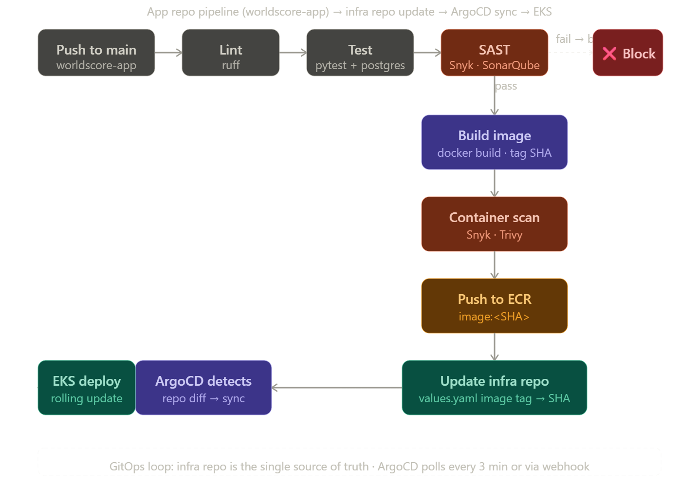
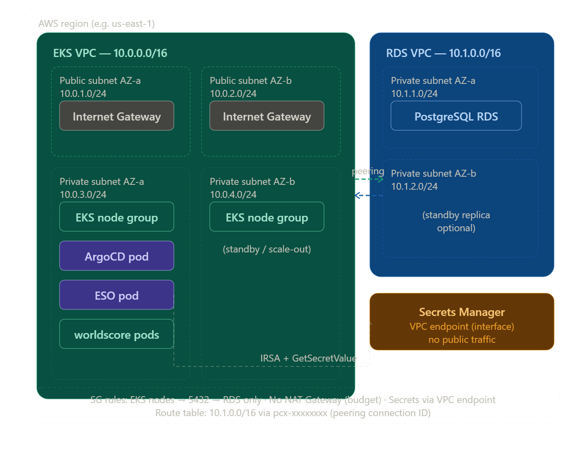

# World Cup Infrastructure — Project Learnings

A production-pattern AWS platform built to deploy a containerized Python API. The project covers the full lifecycle: infrastructure provisioning, secret management, container delivery, GitOps deployment, and security scanning.



---

## Table of Contents

1. [What This Project Builds](#what-this-project-builds)
2. [Architecture Overview](#architecture-overview)
3. [Infrastructure as Code — Terraform](#infrastructure-as-code--terraform)
4. [Remote State — S3 + DynamoDB](#remote-state--s3--dynamodb)
5. [Networking — VPC](#networking--vpc)
6. [Compute — EKS](#compute--eks)
7. [Database — RDS PostgreSQL](#database--rds-postgresql)
8. [Secret Management — AWS Secrets Manager + ESO](#secret-management--aws-secrets-manager--eso)
9. [Container Registry — ECR](#container-registry--ecr)
10. [GitOps — ArgoCD](#gitops--argocd)
11. [CI/CD — GitHub Actions](#cicd--github-actions)
12. [Security Scanning — Snyk, Trivy, SonarQube](#security-scanning--snyk-trivy-sonarqube)
13. [Observability — VPC Flow Logs + CloudWatch](#observability--vpc-flow-logs--cloudwatch)
14. [The Application](#the-application)
15. [Deployment Order](#deployment-order)
16. [Key Learnings](#key-learnings)

---

## What This Project Builds

**Two repos, one system:**

| Repo | Purpose |
|---|---|
| `world-cup-app` | Python FastAPI app — fetches football scores, stores in PostgreSQL, serves a frontend |
| `world-cup-infra` | All infrastructure — Terraform, Helm chart, ArgoCD manifest, GitHub Actions workflows |

The app has zero AWS imports. It reads config from environment variables. Where those env vars come from — `.env` locally, Kubernetes Secrets in production via External Secrets Operator — is entirely the infra layer's concern. This boundary is deliberate.

---

## Architecture Overview

CI/CD Pipeline flow:


Network/VPC topology:


**Traffic path in production:**
```
Internet
  → Application Load Balancer (public subnets)
  → EKS worker nodes (private subnets)
  → App pods (world-cup namespace)
  → RDS PostgreSQL (private RDS subnets, same VPC)

Secrets:
  AWS Secrets Manager → ESO controller → Kubernetes Secret → Pod env vars
```

---

## Infrastructure as Code — Terraform

**What it is:** Terraform is a declarative IaC tool. You describe the desired state of your AWS resources in `.tf` files. Terraform computes the difference between what exists and what you've declared, then applies the delta.

**Why not ClickOps (console)?** Manual console changes are undocumented, unrepeatable, and invisible to code review. Terraform gives you: version control, PR review before changes land, repeatable environment creation, and a plan step that shows exactly what will change before anything happens.

**Module structure:**

```
terraform/
  modules/          ← all resource definitions (never applied directly)
    networking/     ← VPC, subnets, security groups, flow logs
    eks/            ← EKS cluster and node group
    rds/            ← RDS instance and subnet group
    ecr/            ← ECR repository
    iam/            ← GitHub Actions OIDC provider and role
    secrets-global/ ← football-api secret
    secrets-platform/ ← ESO IAM role, VPC endpoint
    observability/  ← VPC Flow Logs, CloudWatch log group
  global/           ← long-lived resources (ECR, IAM, the football-api secret)
  platform/         ← spinnable stack (VPC, EKS, RDS) — destroy overnight to save cost
```

**The key design decision:** `global/` and `platform/` have different lifecycles. Global resources (ECR, IAM roles) persist for the life of the project. Platform resources (the EKS cluster, RDS instance) can be torn down and recreated. This makes overnight cost savings practical — `terraform destroy` on `platform/`, `terraform apply` the next day, the cluster is back.

Modules contain no `backend.tf` and are never `init`'d directly. Only root modules (`global/`, `platform/`) are applied. This enforces a consistent rule: resource definitions and entrypoints are kept separate.

**Apply order:**
```bash
cd terraform/global  && terraform init && terraform apply   # once
cd terraform/platform && terraform init && terraform apply  # each spin-up
```

---

## Remote State — S3 + DynamoDB

**The problem:** By default, Terraform state lives in a local file. The moment two people (or two CI jobs) run Terraform, they get conflicting state and corrupted infrastructure.

**The solution:** Store state in S3, use DynamoDB for locking.

| Component | Role |
|---|---|
| S3 bucket (`world-cup-tfstate`) | Stores the state file remotely — any machine can read/write it |
| State versioning | S3 versioning enabled — roll back a corrupted state to a previous version |
| Server-side encryption | State is encrypted at rest with AES-256 |
| `use_lockfile = true` | S3-native locking in Terraform ≥ 1.10 — only one `apply` runs at a time |

**The chicken-and-egg problem:** You cannot use Terraform to create the bucket Terraform needs to store its own state. The bucket is bootstrapped once manually via the AWS CLI before any Terraform code runs.

**Cross-stack references:** `platform/` reads outputs from `global/` using `terraform_remote_state`. Within `platform/`, modules reference each other directly via module outputs because they share a single state file.

---

## Networking — VPC

**What it is:** A VPC (Virtual Private Cloud) is a logically isolated network inside AWS. Everything — EKS nodes, RDS — runs inside it. You control the IP range, subnet layout, routing, and what can reach what.

**Architecture — single VPC, three subnet tiers:**

| Subnet | CIDR | Type | Contains |
|---|---|---|---|
| public-1/2 | 10.0.1-2.0/24 | Public | Load balancer |
| eks-1/2 | 10.0.3-4.0/24 | Private | EKS worker nodes |
| rds-1/2 | 10.0.5-6.0/24 | Private | RDS instance |

Public subnets have a route to the Internet Gateway. Private subnets do not — pods and the database are not reachable from the internet.

**Security groups (layered firewall):**
```
Internet → lb-sg (80/443) → eks-nodes-sg (container port 8080) → rds-sg (5432)
```
Each security group only accepts traffic from the group upstream of it, not from anywhere.

**VPC endpoints:** The EKS nodes are in private subnets with no internet route. They still need to pull images from ECR and read secrets from Secrets Manager. VPC Interface Endpoints route this traffic over the AWS private network instead of requiring a NAT Gateway. Endpoints provisioned: `ecr.api`, `ecr.dkr`, `secretsmanager`, `sts`, `logs`, and an S3 Gateway endpoint.

**Why two AZs?** Subnets are created in two Availability Zones. If one AZ has an outage, EKS can reschedule pods to nodes in the other AZ, and RDS subnet groups require coverage across at least two AZs.

**VPC Flow Logs:** Captures metadata (source IP, destination, port, protocol, bytes) for every packet that traverses the VPC. Written to a CloudWatch Logs log group. Useful for: debugging connectivity failures, auditing unexpected traffic patterns, compliance.

---

## Compute — EKS

**What it is:** EKS (Elastic Kubernetes Service) is a managed Kubernetes control plane. AWS runs the API server, etcd, scheduler, and controller manager. You are responsible for the worker nodes.

**Kubernetes** is a container orchestrator. It schedules containers onto nodes, restarts them when they crash, scales them up and down, and routes traffic to healthy instances via Services.

**Cluster config:**
| Setting | Value |
|---|---|
| Kubernetes version | 1.31 |
| Node group | 2–4 × `t3.small`, SPOT capacity |
| Node placement | Private subnets only |
| Add-ons | `vpc-cni`, `coredns`, `kube-proxy` |
| IRSA | Enabled |

**SPOT instances:** Worker nodes use EC2 Spot (unused capacity at a discount, ~60-70% cheaper than On-Demand). For a learning project this is ideal. Spot instances can be reclaimed with a 2-minute warning; Kubernetes reschedules pods automatically.

**IRSA (IAM Roles for Service Accounts):** The critical insight here — pods need to call AWS APIs (ECR image pull, Secrets Manager reads) but you must never store access keys in a pod or image.

IRSA solves this with OIDC federation:
1. EKS registers an OIDC identity provider with AWS IAM
2. A Kubernetes service account is annotated with an IAM role ARN
3. EKS injects a short-lived web identity token into pods that use that service account
4. AWS STS validates the token and returns temporary credentials scoped to the IAM role
5. The pod calls AWS APIs using those credentials — no access key ever stored anywhere

**Key Kubernetes objects in this project:**
| Object | Purpose |
|---|---|
| `Deployment` | Runs 2 replicas of the API pod, handles rolling updates |
| `CronJob` | Scheduled daily fetch of scores — calls `/scores/fetch` on a cron schedule |
| `Service` | Stable ClusterIP endpoint routing traffic to healthy pods |
| `ServiceAccount` | Identity for pods; annotated with ESO's IAM role ARN |
| `ExternalSecret` | Instructs ESO to sync a secret from Secrets Manager |

---

## Database — RDS PostgreSQL

**What it is:** RDS is a managed relational database. AWS handles OS patching, PostgreSQL upgrades, automated backups, and hardware replacement. You pay for an instance; AWS handles the operational burden.

**Config:**
| Setting | Value |
|---|---|
| Engine | PostgreSQL 16 |
| Instance class | `db.t3.micro` |
| Storage | 20 GB gp3 |
| Backups | 7-day automated retention |
| Multi-AZ | Disabled (cost — single AZ for learning) |
| Public access | False |
| Master password | AWS-managed via Secrets Manager |

**`manage_master_user_password = true`:** This is the important pattern. When enabled, RDS generates the master password itself and stores it in AWS Secrets Manager. The password never appears in Terraform state, never in your code, never visible to you. AWS rotates it automatically. The ESO controller reads it from Secrets Manager and syncs it into a Kubernetes Secret — no human ever handles the password.

**Network isolation:** RDS sits in private subnets (`10.0.5-6.0/24`). Its security group (`rds-sg`) only accepts inbound connections on port 5432 from the EKS node security group. Nothing else can connect. There is no bastion host — to connect for debugging, you run a temporary pod inside the cluster with `kubectl run`.

**Alembic migrations:** Schema changes are applied via Alembic, run as a one-off pod inside the cluster. This ensures migrations run from inside the private network with the same credentials the app uses.

---

## Secret Management — AWS Secrets Manager + ESO

This is the most architecturally important layer — how secrets flow from AWS into running pods without ever being stored in Git, images, or Kubernetes manifests.

**Secrets in this project:**
| Secret name | Contents | Created by |
|---|---|---|
| `world-cup/db` | host, port, username, password | RDS (`manage_master_user_password`) |
| `world-cup/football-api` | API key and base URL | Terraform + manual update |

**The full data flow:**
```
AWS Secrets Manager
    world-cup/db  →  {"host":"...", "port":"5432", "password":"..."}
         ↓ (read by ESO via IRSA — no credentials stored)
    Kubernetes Secret: world-cup-db-secret
         ↓ (mounted as env vars)
    Pod: DB_HOST, DB_PORT, DB_PASSWORD
         ↓
    config.py: pydantic-settings reads os.environ
```

**External Secrets Operator (ESO):** A Kubernetes controller that reads from external secret stores and creates native Kubernetes `Secret` objects. Key resources:

- `ClusterSecretStore` — tells ESO where to find secrets (AWS Secrets Manager, `us-east-1`) and how to authenticate (IRSA)
- `ExternalSecret` — a CRD in your app namespace specifying which secret keys to pull and what to name them in the resulting K8s Secret

The app pod has no knowledge of ESO or Secrets Manager. It reads plain environment variables from a Kubernetes Secret. ESO is the bridge.

**`refreshInterval`:** ESO re-reads the external secret on a schedule (1 hour in production). If you rotate a secret in Secrets Manager, ESO picks it up at the next sync cycle. Pods are not automatically restarted — you must trigger a rollout if you need immediate propagation.

**Why not just put secrets in Helm values or GitHub secrets?**
- Helm values are committed to Git — secrets would be in your repo history
- GitHub Actions secrets only exist in CI — not available to running pods
- ESO keeps secrets out of Git entirely and provides a live sync from the authoritative source

---

## Container Registry — ECR

**What it is:** ECR (Elastic Container Registry) is AWS's managed Docker registry. It stores the versioned container images for the world-cup API.

ECR lives in `terraform/global/` — it persists across platform stack teardowns. You do not want to lose your image history when you destroy the EKS cluster for the night.

**Image tagging convention:** Images are tagged with the Git commit SHA (`${{ github.sha }}`). This makes every deployed version traceable back to the exact commit that built it. The `latest` tag is used as a fallback in `values.yaml` but the commit-SHA tag is what CI/CD writes after each build.

**Node pull auth:** EKS worker nodes use an IAM role (`AmazonEC2ContainerRegistryReadOnly`) to pull images from ECR without storing any credentials on the node. This is the node group IAM role, distinct from the IRSA roles used by pods.

---

## GitOps — ArgoCD

**What it is:** ArgoCD is a GitOps continuous delivery controller for Kubernetes. It watches a Git repository and continuously reconciles the cluster state to match what is declared in that repo.

**The core principle:** Git is the single source of truth for what runs in the cluster. You never run `kubectl apply` manually in production. You commit to Git; ArgoCD applies it.

**ArgoCD Application manifest** (`argocd/app.yaml`):
```yaml
source:
  repoURL: https://github.com/Eniadebisi/Solutions_Architect.git
  targetRevision: main
  path: world-cup-infra/helm/world-cup
syncPolicy:
  automated:
    prune: true      # delete resources removed from Git
    selfHeal: true   # revert manual cluster changes
  syncOptions:
    - CreateNamespace=true
```

**The deploy loop:**
1. App CI pipeline builds image, pushes to ECR, tags with commit SHA
2. CI opens a PR on `world-cup-infra` updating `image.tag` in `values.yaml`
3. PR is reviewed and merged to `main`
4. ArgoCD detects the `values.yaml` change (polls every 3 min or via webhook)
5. ArgoCD renders the Helm chart with the new tag and applies the diff
6. Kubernetes performs a rolling update — new pods start, old pods drain
7. ArgoCD reports `Synced` and `Healthy`

**Why the PR step?** The infra PR is an intentional review gate. You can see exactly what image tag will be deployed before it lands. Auto-merge is possible for fully automated deploys but the manual merge is safer while learning.

**Self-heal:** If someone manually runs `kubectl apply` and changes a resource directly, ArgoCD detects the drift and reverts it. This enforces GitOps discipline — Git is always authoritative.

**Rollback:** Because every deploy is a Git commit, rollback is `git revert` plus a merge. ArgoCD also supports `argocd app rollback world-cup <history-id>` to instantly revert to a previous sync.

---

## CI/CD — GitHub Actions

**What it is:** GitHub Actions is a CI/CD platform built into GitHub. Workflows are YAML files in `.github/workflows/` triggered by events (push, pull request, manual dispatch).

**Two workflows in this repo (infra side):**

### `pr-checks.yml` — runs on every PR to `main`

| Job | What it does |
|---|---|
| `fmt-check` | `terraform fmt -check` — fails if any `.tf` file is not properly formatted |
| `validate` | `terraform validate` on both stacks — catches syntax errors and missing variables |
| `plan-global` | Full Terraform plan for the global stack, posted as a PR comment |
| `plan-platform` | Full Terraform plan for the platform stack, posted as a PR comment |
| `helm-lint` | `helm lint` on the world-cup Helm chart — catches template errors |
| `security-scan` | Trivy + Snyk IaC scan of all Terraform and Helm files |

The PR plan comment is the critical feature — reviewers see exactly what infrastructure will change before approving. No surprises after merge.

### `terraform-apply.yml` — manual trigger only

A `workflow_dispatch` workflow with a `stack` input (`global`, `platform`, or `both`). Applies the chosen stack using OIDC authentication. The `apply-platform` job has `needs: apply-global` — if you pick `both`, global runs first.

**OIDC keyless auth — the important security pattern:**

Instead of storing an AWS access key as a GitHub secret (a long-lived credential that must be rotated), GitHub Actions acts as an OIDC identity provider:

1. AWS IAM has a registered OIDC provider for `token.actions.githubusercontent.com`
2. The CI IAM role trust policy restricts assumption to your specific GitHub repo
3. In the workflow, `aws-actions/configure-aws-credentials` exchanges the OIDC token for temporary STS credentials
4. Credentials expire when the job ends — no stored secrets, no rotation needed

**App-side pipeline** (in `world-cup-app` repo, documented in [docs/github-actions.md](docs/github-actions.md)):

| Stage | Job |
|---|---|
| `ci.yml` | lint (ruff) → test (pytest + Postgres service container) → SAST (Snyk + SonarQube) → build → container scan |
| `deploy.yml` | push image to ECR → open infra PR updating `values.yaml` |

The Postgres service container in the test job runs alongside the test runner — no external DB needed. The `options` health check block ensures Postgres is ready before tests start.

---

## Security Scanning — Snyk, Trivy, SonarQube

Three tools scanning three different surfaces:

### Trivy (IaC misconfiguration)
Scans Terraform files and Helm charts for misconfigurations: open security groups, unencrypted storage, missing resource limits, containers running as root. Runs in the infra PR pipeline on every PR. Exits non-zero on HIGH or CRITICAL findings.

```bash
trivy config terraform/   # scan Terraform
trivy config helm/world-cup/  # scan Helm chart
```

### Snyk (dependency CVEs + container scanning)
Scans Python dependencies (from `pyproject.toml`) and the built Docker image for known CVEs. Checks against a continuously updated vulnerability database. Reports which transitive dependency introduced a CVE and whether a fixed version exists.

```bash
snyk test --file=pyproject.toml --severity-threshold=high
snyk container test world-cup:latest --severity-threshold=high
```

**Severity threshold:** Only HIGH and CRITICAL findings block the pipeline. MEDIUM and LOW are reported but do not fail the build. This is a common triage decision — low-severity findings in a dev project should not halt all deploys.

### SonarQube / SonarCloud (static code analysis)
Analyzes Python source code for security hotspots, vulnerability patterns (hardcoded credentials, SQL injection), code smells, and test coverage. The quality gate (a set of conditions like "no new Critical findings") must pass for a PR to merge.

SonarCloud is the hosted version — free for public repos, integrates with GitHub as a PR status check.

**The distinction between tools:**
- Trivy catches IaC configuration mistakes
- Snyk catches known CVEs in third-party packages
- SonarQube catches security issues in your own code logic

All three are needed because they catch different classes of problems.

---

## Observability — VPC Flow Logs + CloudWatch

**VPC Flow Logs:** Every network connection attempt within the VPC is logged — source IP, destination IP, port, protocol, bytes, accept/reject decision. Stored in a CloudWatch Logs log group. Uses:
- Debugging connectivity failures (did the packet reach the RDS security group? Was it rejected?)
- Auditing unexpected traffic patterns
- Compliance evidence

**CloudWatch Logs:** AWS's log aggregation service. EKS pods write to stdout; the `aws-node` (vpc-cni) daemonset forwards these to CloudWatch when configured. The Flow Logs module provisions a dedicated log group.

**kubectl for real-time observability:**
```bash
kubectl logs -f <pod-name> -n world-cup      # live tail
kubectl top nodes                             # node CPU/memory
kubectl top pods -n world-cup                # pod CPU/memory
kubectl get events -n world-cup --sort-by='.lastTimestamp'  # event stream
```

**Structured logging in the app:** The Python app uses `structlog` configured for JSON output. Every log entry includes `timestamp`, `level`, `event`, and `service: world-cup-api`. JSON logs are machine-parseable — CloudWatch Insights can run queries against them.

**What's not in this project (next steps):**
- Prometheus + Grafana for metrics dashboards
- Alertmanager for alert routing
- OpenTelemetry for distributed tracing
- AWS Container Insights for deep EKS metrics

The current observability baseline is adequate for a learning project and establishes the patterns needed to add those layers.

---

## The Application

**Stack:** Python 3.12, FastAPI, SQLAlchemy 2 (async), asyncpg, httpx, pydantic-settings, structlog.

**Endpoints:**

| Endpoint | Behaviour |
|---|---|
| `GET /health` | Liveness probe — `{"status": "ok"}` |
| `GET /scores/latest` | Most recent scores from DB (no external call) |
| `GET /scores/fetch` | Live pull from football API → upsert to DB → return results |
| `GET /fixtures/next` | Next upcoming match from DB |
| `GET /` | Serves static frontend |

**Helm chart** (`helm/world-cup/`):
| Template | What it creates |
|---|---|
| `deployment.yaml` | 2-replica API Deployment with resource limits |
| `service.yaml` | ClusterIP Service on port 8080 |
| `serviceaccount.yaml` | ServiceAccount annotated with ESO IAM role ARN |
| `external-secret.yaml` | ExternalSecret pulling DB and football-api secrets |

`image.tag` in `values.yaml` is the file that CI/CD updates with each new commit SHA. ArgoCD detects that change and triggers the rolling update.

---

## Deployment Order

```
1. Bootstrap backend         aws s3api / aws dynamodb (once, manual)
2. Apply global stack        terraform apply in terraform/global/
3. Apply platform stack      terraform apply in terraform/platform/
4. Configure kubectl         aws eks update-kubeconfig
5. Install ArgoCD            helm install argo/argo-cd
6. Install ESO               helm install external-secrets/external-secrets
7. Apply ArgoCD app          kubectl apply -f argocd/app.yaml
8. Push an image to ECR      GitHub Actions app pipeline
9. Watch ArgoCD sync         argocd app get world-cup
```

**Tear-down order (reverse):**
```
kubectl delete application world-cup -n argocd
helm uninstall argocd -n argocd
helm uninstall external-secrets -n external-secrets
cd terraform/platform && terraform destroy
# ECR, IAM, and the football-api secret in global/ remain intact
```

---

## Key Learnings

**Separation of concerns across repos:** The app repo has no AWS imports and no Kubernetes manifests. The infra repo has no application logic. This boundary is the right call — teams can move independently, and a broken infra change cannot break app tests.

**Never store credentials in state or Git:** `manage_master_user_password` on RDS, IRSA for pod identity, OIDC for CI — every layer uses short-lived or AWS-managed credentials. No long-lived access keys anywhere.

**Terraform module pattern:** All resource definitions live in `modules/`. Root modules (`global/`, `platform/`) only contain backend config and module calls. This enforces consistent discipline and makes it possible to understand what each stack contains at a glance.

**Global vs platform lifecycle:** Splitting long-lived resources (ECR, IAM) from spinnable resources (EKS, RDS) makes cost management practical. You can destroy the compute stack without losing your images or secrets.

**GitOps over `kubectl apply`:** ArgoCD's self-heal means the cluster state always converges to Git. Rollback is a Git revert. Audit history is Git history. This is qualitatively different from imperative `kubectl apply` workflows.

**Defense in depth on secrets:** The chain — Secrets Manager → IRSA → ESO → K8s Secret → pod env var — means a secret is never in plaintext anywhere in the pipeline. Each layer only has the minimum access it needs.

**The PR plan comment:** Posting Terraform plan output as a PR comment is a small thing with significant impact. Infrastructure reviewers see exactly what will change before approving. This prevents the "I thought it was a small change" category of incidents.

**IaC scanning catches config mistakes early:** Trivy and Snyk catch misconfigurations (open security groups, unencrypted storage) at PR time, before they reach AWS. Running both tools catches different classes of issues — defense in depth applies to scanning too.